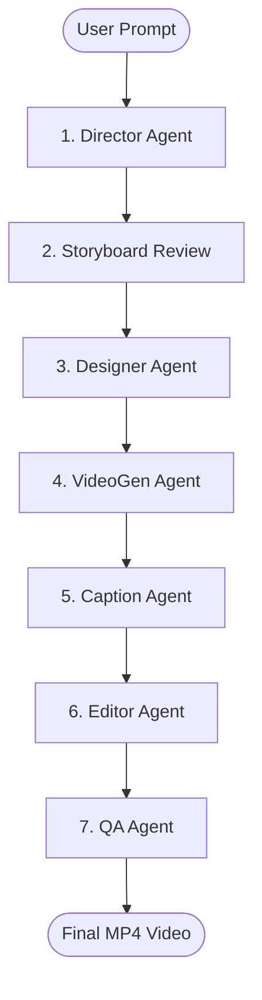

# ScriptForge 🎬🤖

ScriptForge is an autonomous, multi-agent AI video generation pipeline that orchestrates the entire process of turning a raw text concept into a fully produced video. Built with a **React/Vite** frontend, a **Node.js (TypeScript) + Express** backend, and powered by **LangGraph** & **Azure OpenAI/Sora/Flux** services, ScriptForge demonstrates how a chain of specialized AI agents can collaborate to automate creative video production.

The pipeline utilizes **FFmpeg** on the backend to stitch generated clips, pad them, add transitions, generate subtitles, overlay background audio, and output a polished video ready for review.

---

## 🌟 Features & Pipeline Workflow

ScriptForge structures the video creation process into a 5-step collaborative workflow, with each stage handled by a dedicated agent:



### 1. 🎬 Director Agent (LangGraph Stage 1)
- **Inputs:** Raw user prompt/concept.
- **Role:** Analyzes the narrative idea, refines the script, establishes a **Visual Bible** (art style, lighting, camera settings, color palette, render quality, environments, and character descriptions), determines a universal aspect ratio, and breaks the concept down into a structured sequence of scene blueprints (scene descriptions, image generation prompts, and video generation prompts).

### 2. 🎨 Designer Agent (Storyboard Stage)
- **Role:** Generates keyframe images matching the storyboard scenes.
- **Modes:**
  - **API Mode:** Calls the Azure Flux API (`FLUX-1.1-pro`) using the generated image prompts to generate and save images.
  - **Mock Mode (Default):** Falls back to pre-saved mock images in the backend asset directory for rapid local development.

### 3. 📹 VideoGen Agent (Motion Stage)
- **Role:** Generates motion clips from the storyboard keyframe images.
- **Modes:**
  - **API Mode:** Sends video generation prompts and image-to-video contexts to the Azure Sora Video Gen API, polling the status until completion.
  - **Mock Mode (Default):** Falls back to pre-saved local video clips.

### 4. 🔤 Caption Agent
- **Role:** Utilizes an LLM to condense each scene's detailed description into a concise, high-impact subtitle overlay (maximum of 8 words) for display in the final cut.

### 5. ✂️ Editor Agent (FFmpeg Stitching)
- **Role:** Dynamically constructs an FFmpeg command to:
  - Trim each video scene to exactly 5 seconds.
  - Scale and pad clips to a standard resolution of `1280x720` (maintaining original aspect ratios).
  - Add text overlays (subtitles) using system fonts (`DejaVuSans-Bold.ttf`).
  - Mix in background music (`1.mp3`).
  - Concatenate all processed streams into a final high-quality `.mp4` video.

### 6. 🔍 QA Agent (Quality Assurance)
- **Role:** Verifies that the stitched output file exists and is valid (size > 1KB).
- **Bonus:** Calls an LLM to generate a cinematic, fun "Director's QA Report Card" critiquing the team's production output.

---

## 📁 Repository Structure

```text
ScriptForge/
├── backend/                  # Node.js + Express backend service
│   ├── src/
│   │   ├── agents/           # Specialized agent definitions (Director, Designer, etc.)
│   │   ├── azure/            # Azure OpenAI and model API connections
│   │   ├── exports/          # Generated output images and finished stitched videos
│   │   ├── Mock-assets/      # Mock images, videos, audio, and font files for fallback/mock runs
│   │   ├── state/            # LangGraph workflow state configuration
│   │   ├── index.ts          # State Graph compiler and core module exports
│   │   └── server.ts         # Express server and pipeline API endpoints
│   ├── package.json
│   └── tsconfig.json
├── frontend/                 # React + TypeScript + Vite frontend
│   ├── src/
│   │   ├── App.tsx           # Main application UI and workflow state machine
│   │   ├── index.css         # Styling system & dark mode aesthetics
│   │   └── main.tsx
│   ├── package.json
│   └── vite.config.ts
└── vps_deployment/           # Production VPS helper files
    ├── setup_vps.sh          # Shell script to install system dependencies on Ubuntu
    └── nginx.conf            # Nginx config for static routing and API reverse-proxying
```

---

## 🛠️ Prerequisites & Installation

To run this application locally, you will need:
- **Node.js** (v20+ recommended)
- **npm** (v10+ recommended)
- **FFmpeg** (installed and added to your system's PATH)
- **TrueType Font** (`DejaVuSans-Bold.ttf` or configured path in `editor.ts`)

### Local System Dependencies

#### macOS:
```bash
brew install ffmpeg
```

#### Ubuntu / Debian:
```bash
sudo apt update
sudo apt install -y ffmpeg fonts-dejavu-core
```

---

## 🚀 Getting Started (Local Run)

### 1. Clone & Install Dependencies
First, install the packages for both the backend and frontend services.

```bash
# Go to backend and install
cd backend
npm install

# Go to frontend and install
cd ../frontend
npm install
```

### 2. Configure Environment Variables

#### Backend (`backend/.env`):
Create a `.env` file in the `backend/` directory following the `backend/.env.example` structure:

```env
# Required for LangGraph and agent interactions
AZURE_OPENAI_API_KEY="your-azure-key"
AZURE_OPENAI_ENDPOINT="your-azure-endpoint"
AZURE_OPENAI_API_VERSION="2024-12-01-preview"

# Optional: Required if running in 'api' mode rather than 'mock' mode
AZURE_FLUX_ENDPOINT="your-flux-api-endpoint"
AZURE_FLUX_KEY="your-flux-api-key"
AZURE_SORA_ENDPOINT="your-sora-api-endpoint"
AZURE_SORA_KEY="your-sora-api-key"
```

> 💡 **Note on Run Modes:** By default, the backend runs in **mock mode** unless specified otherwise in the `package.json` configurations or by setting `process.env.MODE = 'api'`. Mock mode does not make Azure Sora or Flux calls, making it ideal for checking UI/stitching logic without API costs.

#### Frontend (`frontend/.env`):
Create a `.env` file in the `frontend/` directory (or use default):

```env
VITE_API_BASE_URL=http://localhost:5000
```

### 3. Start Development Servers

Start the backend service:
```bash
cd backend
npm run dev
```
The server will boot up and print configuration logs:
`Express Server configuring static directories...`
`ScriptForge backend running on http://localhost:5000`

In a separate terminal, start the frontend app:
```bash
cd frontend
npm run dev
```
Open [http://localhost:5173](http://localhost:5173) in your browser to access the ScriptForge pipeline UI!

---

## 🌐 Production VPS Deployment

ScriptForge includes a dedicated deployment framework designed for a standard Linux/Ubuntu VPS.

### Step 1: Initialize System Packages
Upload the files to your server and run the helper shell script to install **Node.js**, **FFmpeg**, and the **PM2 Process Manager**:

```bash
chmod +x vps_deployment/setup_vps.sh
./vps_deployment/setup_vps.sh
```

### Step 2: Build and Run Services under PM2
Once packages are configured:

```bash
# Compile and start backend service
cd backend
npm run build
pm2 start dist/server.js --name scriptforge-backend

# Compile frontend static bundles
cd ../frontend
npm run build
```

### Step 3: Configure Nginx Reverse Proxy
Copy the provided Nginx configuration to direct HTTP traffic. The Nginx server serves the compiled React app directly and proxies `/api/*` endpoints to the Express port (`5000`):

```bash
sudo cp vps_deployment/nginx.conf /etc/nginx/sites-available/scriptforge
sudo ln -s /etc/nginx/sites-available/scriptforge /etc/nginx/sites-enabled/
sudo systemctl restart nginx
```
*(Make sure to update the `server_name` directive and absolute file paths inside `/etc/nginx/sites-available/scriptforge` to match your domain and directories).*

---

## ⚖️ License
Distributed under the ISC License. See `package.json` for details.
